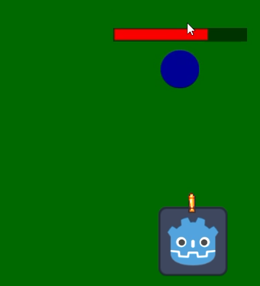

Projeto realizado para a disciplina de Inteligência Artificial para Jogos
Integrantes do grupo:
Danilo de Souza Braga Aciole
João Vitor Calafange de Carvalho Lopes

Steering Behavior:
O inimigo tentara desviar dos disparos realizados pelo player

