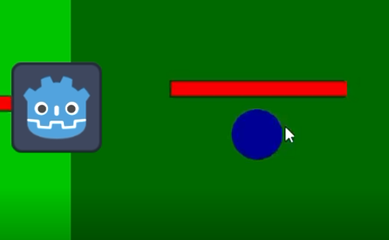
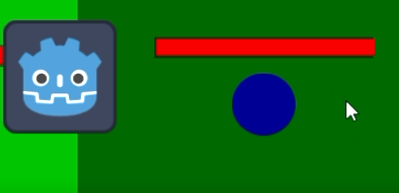
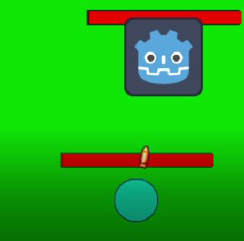

# Projeto de Inteligência Artificial para Jogos

**Integrantes do Grupo:**
- Danilo de Souza Braga Aciole
- João Vitor Calafange de Carvalho Lopes

## Descrição do Projeto

O projeto foi desenvolvido como parte da disciplina de Inteligência Artificial para Jogos, com o objetivo de implementar um sistema de AI para inimigos que reagem de acordo com o estado atual do jogo, utilizando *Behavior Trees* e *Steering Behaviors*.

## Comportamentos do Inimigo

O inimigo no jogo muda seu comportamento com base em seu estado atual. Abaixo, estão descritos os três principais comportamentos implementados.

### 1. **Perseguindo**

O inimigo começa a perseguir o jogador quando ele entra em seu campo de visão. Esse comportamento é ativado quando o inimigo detecta a presença do jogador e o segue até uma distância apropriada.

#### Exemplo Visual - Perseguindo:

### 2. **Atacando**

Existem dois tipos de inimigos no jogo: inimigos corpo a corpo e inimigos à distância. O exemplo abaixo demonstra o comportamento de um inimigo à distância, que ataca o jogador quando está em uma posição segura.

#### Exemplo Visual - Inimigo atacando:

### 3. **Fugindo**

Se o inimigo estiver em desvantagem (por exemplo, com pouca vida ou enfrentando um ataque forte do jogador), ele pode ativar o comportamento de fuga, tentando escapar para uma área segura.

#### Exemplo Visual - Inimigo fugindo:

## Steering Behavior

Além dos comportamentos baseados no estado do inimigo, foi implementado um **Steering Behavior**, onde o inimigo tenta desviar dos disparos feitos pelo jogador. Esse comportamento visa aumentar a dificuldade e a imersão do jogo, tornando a IA mais dinâmica e desafiadora.

#### Exemplo Visual - Inimigo evitando tiros:

