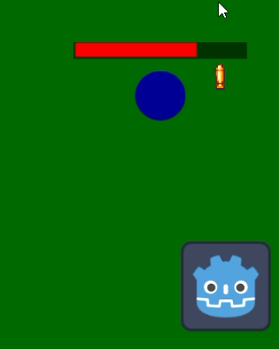
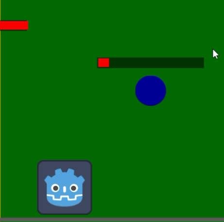
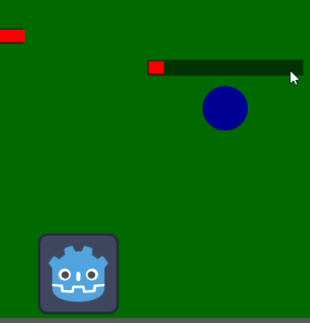

Projeto realizado para a disciplina de Inteligência Artificial para Jogos
Integrantes do grupo:
Danilo de Souza Braga Aciole
João Vitor Calafange de Carvalho Lopes

behavior tree:
O inimigo mudar seu comportamento baseado em seu estado

Perseguindo

Atacando(existe dois tipos de inimigos, foi utilizado o exemplo do inimigo a distancia)

Fugindo

Steering Behavior:
O inimigo tentara desviar dos disparos realizados pelo player

